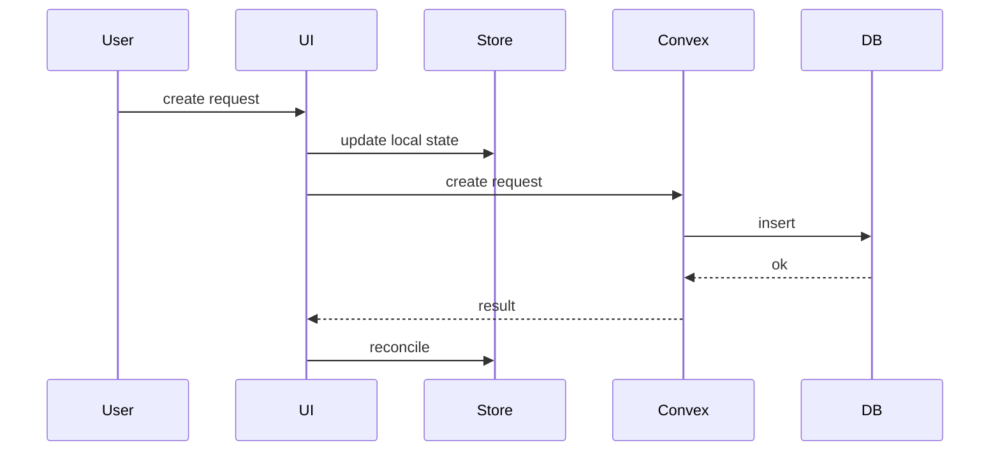
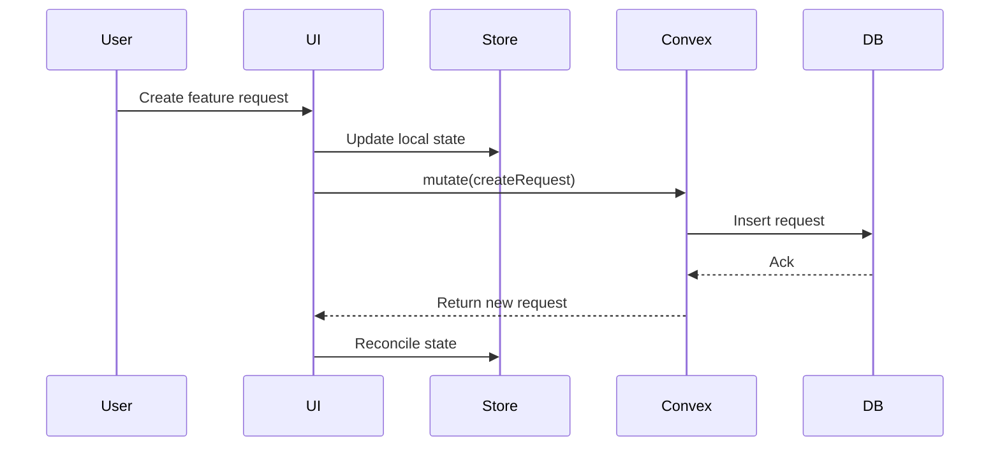

# Architecture — wish-app

## Overview
wish‑app is a TanStack Start app that creates a feature‑request layer between users and developers. It uses **Convex** for backend data + functions and **Clerk** for authentication. The UI is built with React + Tailwind + shadcn and organized into component “atoms/molecules/organisms”.

## High‑level structure
- `src/routes/` — TanStack Router file-based routes
- `src/components/` — UI composition (atoms/molecules/organisms + feature components)
- `packages/convex-backend/convex/` — Convex schema, functions, services
- `src/lib/` — shared utilities (request status, etc.)
- `src/hooks/` — custom React hooks

## Runtime flow
1. **Client routes** render from `src/routes/` (TanStack Router).
2. UI composes components from `src/components/` and calls hooks.
3. Data operations go through **Convex** functions, using Clerk-based auth.
4. Request state is held in client stores and synced with Convex.

## Data & auth
- **Auth**: Clerk (session + user identity)
- **Backend**: Convex functions + database
- **Client state**: stores in `app/stores` (likely Zustand or equivalent)

## Mermaid — system view

```mermaid
sequenceDiagram
  participant User
  participant UI
  participant Store
  participant Convex
  participant DB

  User->>UI: create request
  UI->>Store: update local state
  UI->>Convex: create request
  Convex->>DB: insert
  DB-->>Convex: ok
  Convex-->>UI: result
  UI->>Store: reconcile

```

## Mermaid — request lifecycle

```mermaid
sequenceDiagram
  participant User
  participant UI
  participant Store
  participant Convex
  participant DB

  User->>UI: Create feature request
  UI->>Store: Update local state
  UI->>Convex: mutate(createRequest)
  Convex->>DB: Insert request
  DB-->>Convex: Ack
  Convex-->>UI: Return new request
  UI->>Store: Reconcile state
```

## Key modules
- `src/routes/dashboard.*` — main admin + request dashboard UI
- `src/components/Request` — request cards, list items
- `src/components/Status` — request status UI
- `packages/convex-backend/convex/services` — backend domain services
- `src/lib/requestStatus` — status mapping + helpers

## Build & entrypoints
- **App**: `apps/wish-start/src/` (TanStack Start + TanStack Router)
- **Backend**: `packages/convex-backend/convex/` (Convex functions + schema)
- **Styling**: Tailwind + shadcn UI components
