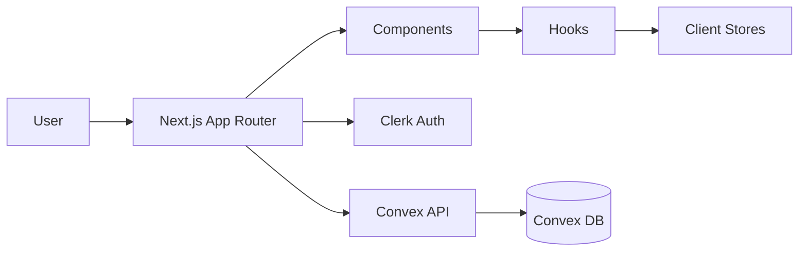

# Architecture — wish-app

## Overview
wish‑app is a Next.js app that creates a feature‑request layer between users and developers. It uses **Convex** for backend data + functions and **Clerk** for authentication. The UI is built with React + Tailwind + shadcn and organized into component “atoms/molecules/organisms”.

## High‑level structure
- `app/` — Next.js app router (pages, layout, providers)
- `components/` — UI composition (atoms/molecules/organisms + feature components)
- `convex/` — Convex schema, functions, services
- `lib/` — shared utilities (request status, etc.)
- `hooks/` — custom React hooks

## Runtime flow
1. **Client routes** render from `app/` (Next App Router).
2. UI composes components from `components/` and calls hooks.
3. Data operations go through **Convex** functions (`convex/`), using Clerk‑based auth.
4. Request state is held in client stores (`app/stores`) and synced with Convex.

## Data & auth
- **Auth**: Clerk (session + user identity)
- **Backend**: Convex functions + database
- **Client state**: stores in `app/stores` (likely Zustand or equivalent)

## Mermaid — system view

## Mermaid — request lifecycle

## Key modules
- `app/dashboard` — main admin + request dashboard UI
- `components/Request` — request cards, list items
- `components/Status` — request status UI
- `convex/services` — backend domain services
- `lib/requestStatus` — status mapping + helpers

## Build & entrypoints
- **App**: `app/` (Next.js App Router)
- **Backend**: `convex/` (Convex functions + schema)
- **Styling**: Tailwind + shadcn UI components
